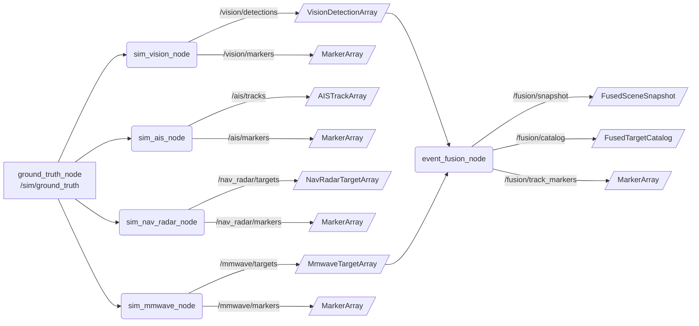

# USV 传感器仿真套件

该工作区聚合了四个彼此解耦、可单独部署的 ROS 2 Python/C++ 功能包，用于在无人船（USV）多传感器融合方案中快速搭建真值生成器与多源传感器模拟：

- `ground_truth_sim`：负责生成高频真值与 RViz 轨迹图层，支持 CTRV 运动模型和可配置目标数量。
- `percision_sim`：基于真值话题派生视觉、AIS、导航雷达与 4D 毫米波等仿真节点。
- `usv_event_fusion`：事件驱动融合（单全局航迹表、`threading.Lock` 保护），订阅视觉与毫米波；发布 `FusedSceneSnapshot`、轨迹 `MarkerArray` 等。（旧包 `usv_fusion` 已弃用。）
- `usv_interfaces`：对外公开统一的消息/服务/动作接口及话题常量，保证多语言节点间的数据契约。

> 将四个包放在同一工作区构建后，**推荐**使用 `ros2 launch ground_truth_sim three_sensor_fusion_sim.launch.py` 一键拉起「3 路视觉 + 1 路毫米波 + 视场角 Marker + 融合 + RViz」参考栈；也可使用旧版 `full_stack_sim` 或分层单独启动（见下文）。

## 仓库结构

| 目录 | 说明 |
| --- | --- |
| `src/` | ROS 2 工作区的源代码目录，包含所有自研包。|
| `src/sim/` | `ground_truth_sim` 源代码（节点、TF、launch、RViz、参数）。|
| `src/percision_sim/` | 视觉 / AIS / 导航雷达 / 毫米波仿真节点与统一参数 YAML。|
| `src/usv_interfaces/` | 自定义消息（msg）、服务（srv）、动作（action）及话题常量。|
| `src/usv_event_fusion/` | 事件驱动融合 `event_fusion_node`、关联契约与参数/launch。|
| `src/usv_fusion/` | （弃用）定时器融合 `sensor_fusion_node`。|
| `install/`、`build/`、`log/` | colcon 构建生成的安装/产物/日志目录，可随构建刷新。|

## 功能包概览

### 深入阅读

- [ground_truth_sim 详细说明](./src/sim/README.md)
- [percision_sim 详细说明](./src/percision_sim/README.md)
- [usv_interfaces 接口列表](./src/usv_interfaces/README.md)
- [usv_event_fusion 包说明](./src/usv_event_fusion/README.md) · [融合算法参考](./src/usv_event_fusion/docs/usv_event_fusion_algorithm_reference.md)

### ground_truth_sim
- CTRV（Constant Turn Rate and Velocity）模型以 50 Hz 推进全局目标状态，支持随机转向、衰减与自定义数量/尺寸。
- 发布 `/sim/ground_truth`（`usv_interfaces/msg/GlobalTrackArray`）和 `/sim/ground_truth_markers`（`visualization_msgs/msg/MarkerArray`）。
- 自带 `rviz/ground_truth_only.rviz`（仅真值轨迹）与 `rviz/ground_truth_view.rviz`（含多路传感器 Marker）。`ground_truth_sim.launch.py` 只负责静态 TF + `ground_truth_node` + 可选 RViz；传感器由 `percision_sim` 的 launch 单独启动。
- 主要参数集中在 `src/sim/config/ground_truth_params.yaml`，通过 `params_file` launch 参数覆盖。

### percision_sim
- 面向多传感器融合的四个 ROS 2 节点：`sim_vision_node`、`sim_ais_node`、`sim_nav_radar_node`、`sim_mmwave_node`。
- 统一参数文件 `src/percision_sim/config/percision_sim_params.yaml`，可加载到任意节点（`--ros-args --params-file ...`）。
- 每个节点都提供 RViz Marker（球体/文本/贴地块/圆柱+箭头）便于调试。
- `launch/sensors_sim.launch.py` + `percision_sim_params.yaml`：在 **已有** `/sim/ground_truth` 的前提下启动单路视觉 / AIS / 导航雷达 / 毫米波（各一路），由 `start_*` launch 参数开关。
- `launch/three_sensor_sim.launch.py` + `three_vision_one_mmwave_params.yaml`：**3 路视觉（front/left/right，150° 对称覆盖）+ 1 路前向毫米波**；需先运行 `ground_truth_sim.launch.py`。
- `launch/multi_sensor_sim.launch.py` + `multi_sensor_params.yaml`：四摄像头 + 四毫米波；**需先**运行 `ground_truth_sim.launch.py`（或 `full_stack_sim.launch.py`）。可选 RViz 默认加载 `ground_truth_view.rviz`。真值环带等参数改在 `ground_truth_params.yaml`。

### usv_event_fusion
- 节点 **`event_fusion_node`**：**异步回调**触发融合，`vision_topics[]` 与 `/mmwave/targets` **各自独立**一轮观测（不要求同帧雷达+视觉）；输出 **`/fusion/snapshot`**（仅 **已确认** 航迹）、**`/fusion/catalog`**、`/fusion/track_markers`；可选 **`publish_legacy_global_track:=true`** 发布 `/fusion/tracks`。
- 参数：`event_fusion_io.yaml`（话题/外参）+ `event_fusion_algorithm.yaml`（滤波/关联）；启动：`ros2 launch usv_event_fusion event_fusion.launch.py`。


### usv_interfaces
- 统一的消息/服务/动作定义，覆盖 GlobalTrack、VisionDetection、AISTrack、NavRadarTarget、MmwaveTarget、VesselState 等。
- `src/usv_interfaces/include/usv_interfaces/topics.hpp` 与 `src/usv_interfaces/usv_interfaces/topics.py` 暴露命名常量，避免硬编码话题。

## 数据流拓扑

下图展示了真值节点与四个模拟节点之间的话题连接关系（详见下一节的节点对比表）：



## 构建与运行

1. 准备 ROS 2 工作区并拉取仓库：
   ```bash
   mkdir -p ~/usv_ws/src && cd ~/usv_ws/src
   ln -s /home/cczh/temp-code/ground_truth_sim .
   ```
2. 构建（假设已安装系统依赖并 source `/opt/ros/<distro>/setup.bash`）：
   ```bash
   cd ~/usv_ws
   colcon build --packages-select usv_interfaces ground_truth_sim percision_sim usv_event_fusion
   source install/setup.bash
   ```
3. 分层或一键启动示例：
   ```bash
   # 【推荐】3 视觉 + 1 毫米波 + FoV 扇形 + 融合 + RViz
   ros2 launch ground_truth_sim three_sensor_fusion_sim.launch.py

   # 仅真值 + 仅真值 RViz（Grid + /sim/ground_truth_markers）
   ros2 launch ground_truth_sim ground_truth_sim.launch.py

   # 另开终端：在真值已发布时启动 3V+1R 传感器（不含融合）
   ros2 launch percision_sim three_sensor_sim.launch.py

   # 仅融合（需上游话题与 event_fusion_three_sensor_io.yaml 一致）
   ros2 launch usv_event_fusion event_fusion.launch.py \
     io_params_file:=$(ros2 pkg prefix usv_event_fusion)/share/usv_event_fusion/config/event_fusion_three_sensor_io.yaml

   # 旧版一键：单路 sensors_sim + fusion（话题与 ground_truth_view.rviz 不完全匹配）
   ros2 launch ground_truth_sim full_stack_sim.launch.py
   ```
4. 独立运行任意仿真节点，用统一参数文件：
   ```bash
   ros2 run percision_sim sim_nav_radar_node --ros-args \
     --params-file $(ros2 pkg prefix percision_sim)/share/percision_sim/config/percision_sim_params.yaml
   ```

### 一键脚本

仓库提供 `scripts/run_full_sim.sh`，可在已 source 系统 ROS 2 环境后直接运行，实现“清理 -> 全工作区构建 -> source -> `full_stack_sim.launch.py`”：

```bash
./scripts/run_full_sim.sh
```

脚本默认通过 `full_stack_sim.launch.py` 拉起真值、`sensors_sim`（视觉/导航雷达/毫米波，AIS 在脚本中设为 `true`）与 **`event_fusion_node`**，并打开全量 RViz。可在脚本内修改 `ros2 launch` 行以覆盖参数。

若只需“构建 + multi_sensor_sim 多传感器 launch”，可使用新脚本：

```bash
./scripts/run_multi_sensor_sim.sh [额外 ros2 launch 参数]
```

该脚本会先全量清理并 `colcon build` 上述三包，再在 **后台** 启动 `ground_truth_sim.launch.py use_rviz:=false`，随后前台启动 `multi_sensor_sim.launch.py`（默认 `multi_sensor_params.yaml` + `ground_truth_view.rviz`）。`parent_frame` / `child_frame` 在 multi_sensor launch 中为兼容保留的占位参数；静态 TF 由真值 launch 提供。可通过脚本末尾附加参数传给 `multi_sensor_sim`（例如 `use_rviz:=false`）。

## 统一参数管理

- 真值：编辑 `src/sim/config/ground_truth_params.yaml` 或在 launch 时传入 `params_file:=<path>`。
- **3V+1R 参考栈**（sim / overlay / fusion 三方需同步 yaw 与 fov）：
  - 传感器：`src/percision_sim/config/three_vision_one_mmwave_params.yaml`
  - 视场扇形 Marker：`src/sim/config/three_sensor_overlay_params.yaml`
  - 融合 I/O：`src/usv_event_fusion/config/event_fusion_three_sensor_io.yaml`
- 单路传感器：`src/percision_sim/config/percision_sim_params.yaml` 以节点名分组（`sim_vision_node` / `sim_ais_node` / ...），可复制后按场景定制。
- 所有节点都支持以 `--ros-args -p key:=value` 方式覆盖参数，用于一次性调试。

## 传感器模拟对比

| 节点 | 可调参数示例 | 发布频率 | 噪声机制 | 噪声效果 | RViz 象征 |
| --- | --- | --- | --- | --- | --- |
| `sim_vision_node` | `fov_half_angle`、`sigma_angle`、`distance_noise_offset/scale`、`camera_id`/`class_*` | 50 Hz（随真值定时器） | 在极坐标上对角度/距离加入高斯噪声并按视场裁剪 | 方位 ±0.02 rad、距离随平方增长，远距目标置信度下降 | 蓝色球体按尺寸缩放 |
| `sim_ais_node` | `delay_sec`、`timer_period`、`queue_max`、`ship_name_prefix`、`text_height` | 每 0.2 s 检查队列，输出滞后 ≥ `delay_sec` | FIFO 延迟队列，强制保持旧时间戳 | 仅时间轴被“拉长”，空间信息保持真值 | 紫色 TEXT Marker 显示 MMSI |
| `sim_nav_radar_node` | `min_period`、`noise_std`、`area_jitter`、`marker_height` | ≥1 Hz（由 `min_period` 控制） | XY 位置加入 5 m 级高斯噪声，面积随机 ±10% | 位置呈大片抖动，面积读数随波动跳变 | 半透明黄色贴地方块 |
| `sim_mmwave_node` | `radial_noise_std`、`angle_noise_std`、`velocity_noise_std`、`size_jitter`、`snr_min/max`、`cylinder_height` | 与真值同步（默认 50 Hz） | 将目标投到极坐标后对距离/角度/速度施加高斯噪声 | 距离 ±0.5 m、角度 ±0.08 rad、速度 ±0.1 m/s，尺寸 ±20% | 绿色圆柱 + 速度箭头 |

## 关键话题（片段）

| 话题 | 类型 | 生产者 |
| --- | --- | --- |
| `/sim/ground_truth` | `usv_interfaces/msg/GlobalTrackArray` | `ground_truth_node` |
| `/sim/ground_truth_markers` | `visualization_msgs/msg/MarkerArray` | `ground_truth_node` |
| `/vision/detections` | `usv_interfaces/msg/VisionDetectionArray` | `sim_vision_node` |
| `/ais/tracks` | `usv_interfaces/msg/AISTrackArray` | `sim_ais_node` |
| `/nav_radar/targets` | `usv_interfaces/msg/NavRadarTargetArray` | `sim_nav_radar_node` |
| `/mmwave/targets` | `usv_interfaces/msg/MmwaveTargetArray` | `sim_mmwave_node` |
| `/fusion/snapshot` | `usv_interfaces/msg/FusedSceneSnapshot` | `event_fusion_node` |
| `/fusion/catalog` | `usv_interfaces/msg/FusedTargetCatalog` | `event_fusion_node` |
| `/fusion/tracks` | `usv_interfaces/msg/GlobalTrackArray` | `event_fusion_node`（可选 legacy） |
| `/fusion/track_markers` | `visualization_msgs/msg/MarkerArray` | `event_fusion_node` |

更多接口定义请参考 `usv_interfaces/msg/*.msg` 与 README。

## 许可证

所有子包均采用 Apache-2.0 许可证，欢迎在保持版权声明的前提下拓展仿真节点或集成其他感知模块。
