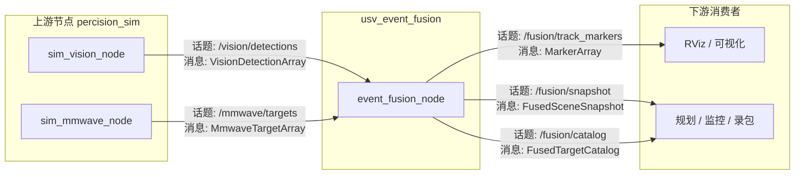
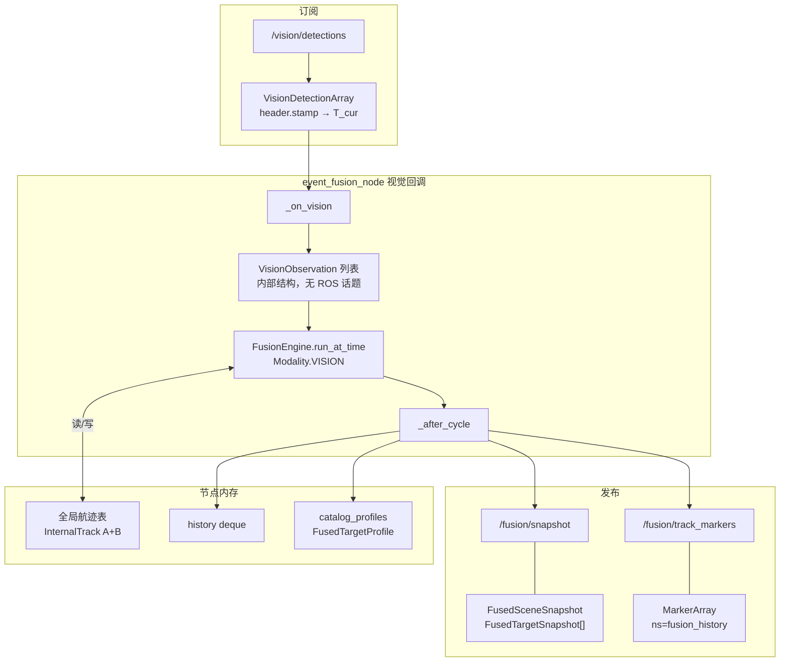
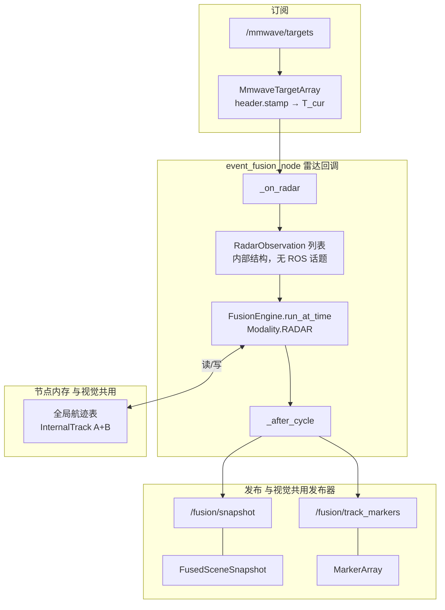
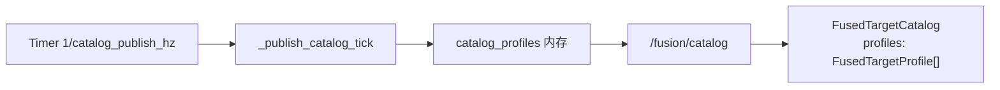
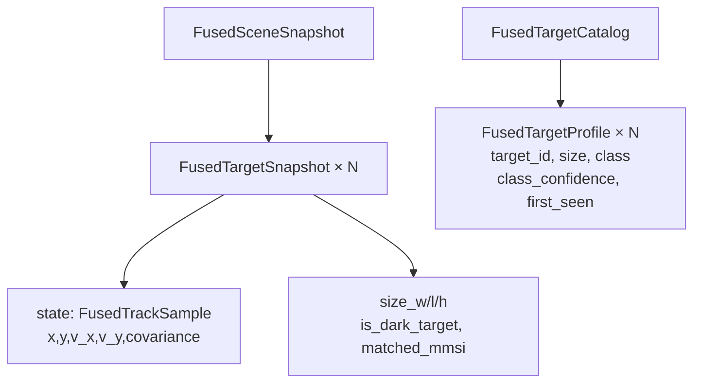
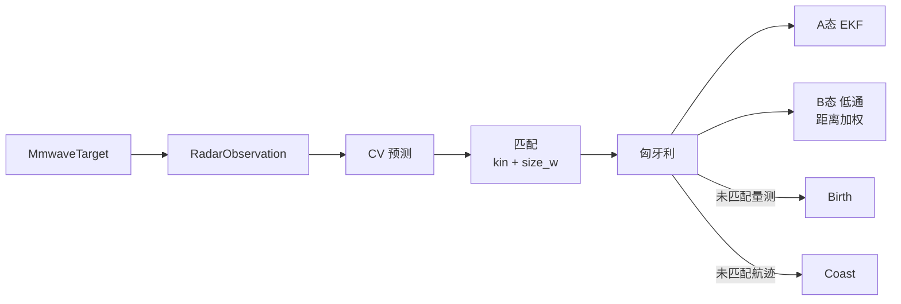

# `usv_event_fusion` 融合算法参考
本文描述本包 **[`usv_event_fusion`](../)** 当前实现：**单张全局航迹表**、**按传感器回调事件推进**、平面 **CV + EKF**（视觉极坐标、雷达笛卡尔）、**匈牙利一对一关联**。
> **与旧实现区别**：[`usv_fusion`](../../usv_fusion/) 采用定时器 + 缓冲选帧，语义不同。
---
## 1. 整体思路
| 要点 | 说明 |
| --- | --- |
| **唯一状态** | `track_id: UUID → InternalTrack`：**A 态**运动学（`mean/cov`）+ **B 态**档案（`TrackProfile`：尺寸低通、类别投票）。 |
| **触发方式** | 视觉或毫米波 **各自订阅回调** → `FusionEngine.run_at_time`；`header.stamp` 经 `stamp_to_sec()` 转为 float64 秒 $T_{\mathrm{cur}}$（纳秒精度）。 |
| **单模态量测** | 每轮只处理当前回调的量测；视觉与雷达 **不要求** 同批到场。 |
| **关联模式** | **椭圆门 + 匈牙利 + coast 虚列**（[`association.py`](../usv_event_fusion/association.py)）。 |
---
## 2. 代码与消息映射
| 角色 | 路径 |
| --- | --- |
| ROS 节点 | [`event_fusion_node.py`](../usv_event_fusion/event_fusion_node.py) |
| 融合引擎 | [`fusion_engine.py`](../usv_event_fusion/fusion_engine.py) |
| UUID / RViz 映射 | [`track_uuid.py`](../usv_event_fusion/track_uuid.py) |
| tracker-tracker 合并 | [`track_overlap.py`](../usv_event_fusion/track_overlap.py) |
| 关联度量 | [`association_metrics.py`](../usv_event_fusion/association_metrics.py) |
| 像素宽度投影 | [`sensor_models.py`](../usv_event_fusion/sensor_models.py) → `profile_width_to_pixel_width` |
| 外部 I/O 参数 | [`event_fusion_io.yaml`](../config/event_fusion_io.yaml) |
| 算法参数 | [`event_fusion_algorithm.yaml`](../config/event_fusion_algorithm.yaml) |
| 单文件合并（可选） | [`event_fusion_params.yaml`](../config/event_fusion_params.yaml) |
---
## 3. 输入（ROS 订阅与字段）

**时间语义**：$T_{\mathrm{cur}} = \texttt{stamp.sec} + \texttt{stamp.nanosec} \times 10^{-9}$（float64 秒，非整数秒截断）。

### 3.1 视觉：`VisionDetectionArray`
- 字段：`azimuth`, `distance_predict`, `size_w`, `size_h`, **`pixel_width`**, `confidence`, `class_id`, `class_name`
- 节点输出 **`VisionObservation`**：机体 $(x,y)$、极坐标 $(r,\theta)$、像素宽度等

### 3.2 毫米波：`MmwaveTargetArray`
- 字段：`radar_id`, `x,y,v_x,v_y`, `size_w/l/h`, `objmotion_status`, `track_id`
- 节点输出 **`RadarObservation`**：机体平面位姿速度 + 尺寸 + 动静状态

---
## 4. 输出（ROS 发布）
| 话题 | 消息类型 | 含义 |
| --- | --- | --- |
| `/fusion/snapshot` | `FusedSceneSnapshot` | 已确认航迹快照（A 态 + B 态尺寸）；`target_id` 为 `unique_identifier_msgs/UUID` |
| `/fusion/catalog` | `FusedTargetCatalog` | 低率档案（含 `class_confidence`）；`target_id` 同上 |
| `/fusion/track_markers` | `MarkerArray` | RViz 轨迹线（Marker.id 为 UUID 哈希） |

---
## 5. 端到端输入 / 输出流程

以下采用 **ROS 计算图**（节点 ↔ 话题 ↔ 消息类型）描述数据流；融合引擎内部算法细节见第 6 节。

### 5.1 系统 ROS 计算图

| 方向 | 话题（默认） | 消息类型 | 发布节点 | 订阅节点 |
| --- | --- | --- | --- | --- |
| 输入 | `/vision/detections` | `VisionDetectionArray` | `sim_vision_node` | `event_fusion_node` |
| 输入 | `/mmwave/targets` | `MmwaveTargetArray` | `sim_mmwave_node` | `event_fusion_node` |
| 输出 | `/fusion/snapshot` | `FusedSceneSnapshot` | `event_fusion_node` | 下游业务 |
| 输出 | `/fusion/catalog` | `FusedTargetCatalog` | `event_fusion_node` | 下游业务 |
| 输出 | `/fusion/track_markers` | `MarkerArray` | `event_fusion_node` | RViz |

> 参数 `vision_topics[]` 可配置多路视觉；`publish_legacy_global_track:=true` 时额外发布 `/fusion/tracks`（`GlobalTrackArray`）。

### 5.2 视觉回调：消息链（单次 `/vision/detections` 到达）

视觉与毫米波 **各自独立回调**，互不等待。下图为视觉一路从订阅到发布的消息变换：

**本链路概要**：匹配 → 更新 → Birth（见 §6.1）→ 发布已确认航迹快照与轨迹 Marker。

### 5.3 毫米波回调：消息链（单次 `/mmwave/targets` 到达）

**本链路概要**：匹配 → 更新 → Birth（见 §6.2）→ 发布快照与 Marker。两路回调通过 **mutex** 串行访问同一航迹表。

### 5.4 定时发布：档案 Catalog

Catalog 与传感器回调 **解耦**：低频汇总历史出现过的 `target_id` 档案（尺寸、类别、`class_confidence` 等），不驱动滤波更新。

### 5.5 输出消息嵌套关系

- **Snapshot（高频）**：当前时刻已确认目标的 **A 态**（`FusedTrackSample`）+ 行内尺寸摘要。
- **Catalog（低频）**：同一 `target_id` 的 **B 态**档案；节点在每次 `_after_cycle` 中刷新内存，定时器负责发布。

---
## 6. 匹配与更新

关联统一为 **匈牙利一对一**；未匹配航迹走 **coast 虚列**，未匹配量测 **Birth** 新航迹。

### 6.1 视觉

**宽度匹配（像素域）**：航迹侧用 profile 距离 + 物理宽度投影为期望像素宽度，与检测 `pixel_width` 比较：

$$\text{track\_px} = \texttt{profile\_width\_to\_pixel\_width}(r_i,\ \bar{w}_i,\ f_{\mathrm{px}})$$

占位针孔模型 $f_{\mathrm{px}} \cdot w / r$（参数 `vision_focal_length_px`，标定后补全）。

**匹配门控**：运动学（极坐标 $r,\theta$）+ 像素宽度软/硬门 + 类别硬门（已确立类别不一致则拒绝）。

**更新**：
- **A 态**：极坐标 EKF（`ekf_update_polar`）
- **B 态**：尺寸低通；**距离越远，尺寸更新权重越小**（`effective_size_lpf_alpha`）；类别近 N 帧投票

### 6.2 毫米波

**宽度匹配（物理域）**：量测 `size_w` 与 profile 低通宽度比较（米）。

**匹配门控**：运动学（4D 位置+速度）+ 宽度软/硬门；**无类别门**。

**更新**：
- **A 态**：线性 EKF（`ekf_update_linear`）
- **B 态**：`size_w/l/h` 低通；**同样按距离衰减尺寸更新权重**；写入 `radar_track_id`

### 6.3 距离加权尺寸更新（视觉与雷达共用）

B 态低通系数随距离衰减：

$$\alpha_{\mathrm{eff}} = \alpha_0 \cdot \mathrm{clip}\!\left(\frac{d_{\mathrm{ref}}}{d},\ w_{\min},\ 1\right)$$

- $d$：量测/航迹距离（视觉用 `range_m`，雷达用平面距离）
- 参数：`profile_size_lpf_alpha`（$\alpha_0$）、`size_update_ref_distance_m`（$d_{\mathrm{ref}}$）、`size_update_min_weight`（$w_{\min}$）
- 含义：**近处**尺寸量测权重大，**远处**尺寸更依赖历史 profile

### 6.4 关键参数（匹配 / 更新）

| 参数 | 视觉 | 雷达 |
| --- | --- | --- |
| 运动学门限 | `chi2_gate_vision` | `chi2_gate_radar` |
| 宽度匹配域 | 像素（`pixel_width` vs 投影 px） | 米（`size_w` vs profile） |
| 宽度噪声 | `width_meas_std_vision_px` | `width_meas_std_radar_m` |
| 投影焦距 | `vision_focal_length_px`（占位） | — |
| 类别门控 | `class_match_min_confidence` | 无 |
| 尺寸更新衰减 | `size_update_ref_distance_m` 等 | 同左 |

---
## 7. 航迹维护（生命周期）
- **ID**：spawn 时 `uuid4()`；对外 `FusedTargetSnapshot.target_id` / `FusedTargetProfile.target_id` 为 ROS UUID。
- **晋升**：`TENTATIVE → CONFIRMED`（`promotion_min_hits`）。
- **发布门控**：coast 快照（`coast_timeout_sec`）。
- **删除**：`track_predict_stop_sec` 超时 prune。
- **抑生**：`spawn_suppression_radius_m` 阻止邻近重复 birth。
- **重叠合并**（`enable_track_merge`）：每轮 associate/spawn 后对 tracker 两两检测（中心距 + width/class 门 + 可选 4D 马氏门）；保留强者 UUID，信息滤波融合 mean/cov/profile 后删除弱者（见 [`track_overlap.py`](../usv_event_fusion/track_overlap.py)）。
---
## 8. 相关文档
- 包内说明：[README](../README.md)
- 全栈启动：[`sim/README.md`](../../sim/README.md)
---
*文档版本与源码一致时请以 `git` 中上述文件为准。*
