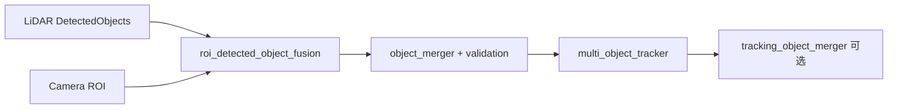
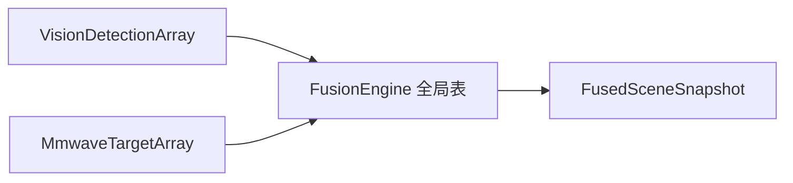

# Autoware 感知融合 vs `usv_event_fusion` 对比与结论

本文档记录 2026-06-03 前后关于 Autoware 感知流水线（见 `fusion_pipeline.md`、`topic.md`）与本包当前实现的讨论结论，并回答：匈牙利 vs muSSP、随机 UUID、`existence_probability` + prune 逻辑，以及五项需单独设计议题的取舍理由。

**文档状态**：2026-06-06 更新（UUID 与 tracker-tracker 重叠合并已实现）。

**相关文档**：

| 文档 | 内容 |
|------|------|
| [`fusion_pipeline.md`](fusion_pipeline.md) | Autoware 分层架构、MOT/TOM、门控与流程 |
| [`topic.md`](topic.md) | Autoware 消息与 Topic I/O |
| [`../docs/usv_event_fusion_algorithm_reference.md`](../docs/usv_event_fusion_algorithm_reference.md) | 本包算法与数据流 |
| [`../README.md`](../README.md) | 本包节点与参数 |

---

## 1. 讨论结论摘要

| 维度 | Autoware 典型做法 | `usv_event_fusion` 当前做法 | 结论 |
|------|-------------------|----------------------------|------|
| **架构** | 检测并行 → 检测融合/合并/验证 → MOT →（可选）TOM → 预测 | 单节点、单全局航迹表、事件驱动按模态步进 | 本包是 **跟踪级统一 EKF**，不是 Autoware 多包流水线 |
| **跨传感器融合位置** | LiDAR↔相机在 **检测级**（ROI 验证）；雷达常在 **TOM 跟踪级** | 视觉/毫米波 **异步** 更新同一 `InternalTrack` | 语义接近 MOT **多通道**，而非 roi_fusion / TOM |
| **关联求解器** | muSSP（最小代价最大流） | `scipy.optimize.linear_sum_assignment`（匈牙利）+ coast 虚列 | 规模下 **无显著优势** 换 muSSP；代价公式差异更大 |
| **关联代价** | 硬门控 AND + **仅 BEV 距离** 归一化 score | χ² 门 + 宽度/类别门 + **马氏距离与宽度加权求和** | 行为差异明显，非求解器 alone |
| **航迹 ID** | MOT spawn 时 **随机 UUID** | spawn 时 **`uuid4` 随机 UUID**，发布为 `unique_identifier_msgs/UUID` | 已与 Autoware/规划 ID 语义对齐 |
| **生命周期** | `existence_probability` 贝叶斯式管理 + prune 重叠合并 | `TENTATIVE/CONFIRMED` + `association_hits` + 超时删除 + 抑生半径 + **tracker-tracker 重叠合并** | 未引入标量 existence；已局部借鉴重叠 merge |
| **时间** | FusionCollector、ROI 偏移、MOT 延迟补偿 | 各回调 `header.stamp` + 增量 CV 预测 | 事件驱动下可接受；大快门差再加强对齐 |

**一句话**：Autoware 把「传感器互证」前移到检测层，把「时序 ID」放在 MOT；本包把「多模态更新」收进 **一张航迹表 + 分模态 EKF**，更短链路、更小目标数，不必为对标而整包替换算法栈。

---

## 2. 架构对照

### 2.1 Autoware（简化）



### 2.2 `usv_event_fusion`



### 2.3 关键差异表

| 项目 | Autoware | 本包 |
|------|----------|------|
| 检测级 LiDAR-相机 | 3D 投影 IoU，无视觉则 **丢弃** LiDAR 检测 | **无**；未匹配量测可 **Birth**（受抑生半径约束） |
| 跟踪输入 | 合并后的 `DetectedObjects`，无 ID | 自定义 `VisionObservation` / `RadarObservation` |
| 状态估计 | 多类别 EKF + 通道 `can_trust_*` | 统一平面 CV；视觉极坐标 / 雷达 4D 线性 EKF |
| 输出 | `TrackedObjects` → `PredictedObjects` | `FusedSceneSnapshot`（仅 **CONFIRMED** 且未 coast 超时） |
| 最大航迹数 | 远大于 12 | `max_internal_tracks: 12`（配置） |

---

## 3. 匈牙利（`linear_sum_assignment`）vs muSSP

### 3.1 各自解决什么问题

| | **匈牙利算法**（本包） | **muSSP**（Autoware MOT / 部分 merger） |
|---|------------------------|----------------------------------------|
| **数学问题** | 二分图 **线性分配问题（LAP）**：在代价矩阵上求 **一对一** 最小（或最大）代价匹配 | MOT 数据关联建模为 **最小代价最大流（min-cost max-flow）** 的专用求解器 |
| **实现** | `scipy.optimize.linear_sum_assignment` | 外部库 [muSSP](https://github.com/yu-lab-vt/muSSP)（NeurIPS 2019） |
| **本包扩展** | 代价矩阵右侧增加 **coast 虚列**（`solve_gated_assignment`），未匹配航迹以 `dummy_cost` 进入最优解，实现「可 coast 的一对一分配」 | 未匹配、多帧关联在流图结构中编码（由图设计决定） |
| **门控** | 门控失败 → `BIG` 代价，不参与有效配对 | 同样先门控，门控失败 score=0，再求最大权匹配 |

Autoware 文档说明：关联在 score 矩阵上做 **maximum score matching**，用 muSSP 解 **min-cost max-flow**（与最大权匹配对偶相关）。在 **仅当前帧、tracker↔detection 一对一** 且已门控稀疏化的矩阵上，**匈牙利与 muSSP 求的是同一类分配最优解**（代价定义一致时结果一致）。

### 3.2 主要区别（不仅是「另一个求解器」）

1. **问题规模与稀疏性**  
   - muSSP 针对 MOT 图 **大规模、高稀疏（~95%）** 优化；Autoware 自测在矩阵规模 **>100** 时明显快于通用 SSP。  
   - 本包 `max_internal_tracks=12`，每步量测数通常个位数，矩阵维度 **远小于 100**，匈牙利 O(n³) 开销可忽略。

2. **图表达能力**  
   - 通用 min-cost flow / muSSP 可表达 **更复杂的关联结构**（多帧、分裂合并、虚拟节点等），取决于图如何建。  
   - 本包显式 **n_meas + n_tracks** 列（含 coast 虚列），语义清晰，与 JPDA 枚举假设解耦。

3. **与代价设计耦合**  
   - Autoware：**门控通过后 score 仅由距离决定**（见 `fusion_pipeline.md` §3.4）。  
   - 本包：**cost = d²_kin + w·d²_width**（`association_metrics.py`），与用匈牙利还是 muSSP **无关**，却与 Autoware 关联行为 **差异更大**。

4. **依赖与维护**  
   - 匈牙利：SciPy 已有依赖，无额外 native 库。  
   - muSSP：需引入 C++ 绑定/第三方包，集成与 CI 成本上升。

### 3.3 是否有明显优势？

| 场景 | 建议 |
|------|------|
| **当前 USV 配置**（≤12 航迹、事件步进、二维） | **无明显优势** 替换 muSSP；匈牙利 + coast 虚列足够，且更易调试。 |
| **航迹/量测涨到百级**、或引入 **多假设关联图** | 可评估 muSSP 或保留 JPDA 枚举路径（`jpda.py` 已预留）。 |
| **要对齐 Autoware 关联「手感」** | 优先改 **门控 + 单一距离 score**，而非先换求解器。 |

**结论**：求解器不是瓶颈；**不必**为对标 Autoware 引入 muSSP，除非规模或图结构显著复杂化。

---

## 4. 航迹 ID：随机 UUID（已实现）

### 4.1 现状

- `FusionEngine._allocate_id()`：`uuid.uuid4()` 随机 UUID。  
- 发布到 `FusedSceneSnapshot` / `FusedTargetCatalog` 的 `target_id` 为 `unique_identifier_msgs/UUID`。  
- RViz `Marker.id` 使用 UUID 稳定哈希（`track_uuid.uuid_to_marker_id`）。

### 4.2 Autoware

- `multi_object_tracker` 在 **spawn** 时为每条航迹生成 **`unique_identifier_msgs/UUID`**（16 字节随机），关联维持至 prune。  
- 规划、`detection_by_tracker`、`map_based_prediction` 等均假设 **稳定 UUID**。

### 4.3 实现要点

| 项 | 说明 |
|----|------|
| **目的** | 与 Autoware / ROS 生态及下游模块 **ID 语义一致**；避免整数 ID 被误当作「可预测枚举」。 |
| **范围** | 内部 `InternalTrack`、`usv_interfaces` 融合消息、`GetTargetHistory.srv`；RViz Marker 哈希着色。 |
| **不影响** | 关联算法本身 **不依赖** ID 类型；匈牙利匹配在索引空间进行。 |
| **注意** | `radar_track_id`（毫米波设备侧 ID）与 **融合 UUID** 仍是两个命名空间，不可混用。 |

---

## 5. `existence_probability` + prune（合并重叠 tracker）详述

Autoware 文档中「存在概率 + prune」出现在 **不同包**，逻辑并不完全相同。需分开理解再谈是否迁移。

### 5.1 `multi_object_tracker`（MOT）— 跟踪主路径

`fusion_pipeline.md` §3.3 每帧流程：

```
predict → associate (muSSP) → update (有测量：EKF；无测量：存在概率衰减)
→ prune（删除过期 / 合并重叠 tracker）→ spawn → publish
```

#### （1）`existence_probability`（`TrackedObjects` 字段）

依据 `topic.md`：跟踪阶段为 **贝叶斯更新 + 衰减**，与检测阶段的 DNN score 不同。

**典型语义（Universe MOT + 各 tracker 实现共性）**：

| 事件 | 对 `existence_probability` 的影响 |
|------|-----------------------------------|
| 本帧 **成功关联** 到检测 | 升高或重置到较高水平（可融合检测的 `existence_probability`，受 `can_trust_existence_probability` 约束） |
| 本帧 **未关联**（coast） | **衰减**（无测量更新 EKF，仅降低存在置信） |
| 低于删除阈值 或 超过 `pruning_time_threshold` / `pruning_ticks_threshold` | **prune 删除** 该 tracker |
| 发布 | 常仅输出 existence 高于某阈值的航迹（与 TOM 的 publish 阈值类似思想） |

**与 EKF 关系**：位置/速度仍由 EKF（或分类模型）管理；`existence_probability` 管 **「这条航迹是否还算存在」** 的置信，用于输出门控与删除，**不替代** 协方差门控。

#### （2）prune：删除过期航迹

- **时间**：超过 `pruning_time_threshold` 未见到检测 → 删除。  
- **计数**：超过 `pruning_ticks_threshold` 个周期无关联 → 删除。  
- 本包对应物：`track_predict_stop_sec`（无滤波更新则从表删除），语义接近 **硬超时 prune**，但 **无** 存在概率渐变过程。

#### （3）prune：合并重叠 tracker（MOT 扩展）

Universe 文档中的 **重叠处理**（参数示例：`overlap_distance_thresholds`、`prune_static_iou_threshold`、`prune_static_object_speed`、`prune_moving_object_speed` 等）大意如下：

| 步骤 | 逻辑 |
|------|------|
| 1. 两两检查 tracker 在 BEV 是否 **几何重叠** | 距离 < 类相关阈值，和/或 **GIoU** > 类相关 IoU 阈值 |
| 2. 区分静态 / 运动 | 低速近邻：倾向 **合并** 或删掉较弱的一条，避免重复 unknown；高速运动：另一套合并策略，减少「同一车两条 UUID」 |
| 3. 保留策略 | 通常保留 **existence 更高、寿命更长、或关联更稳定** 的一条，删除或吸收另一条 |
| 4. 目的 | 抑制 **双 spawn**、检测抖动、分类切换导致的 **ID 分裂** |

本包 **已实现** tracker-tracker 几何合并（`track_overlap.py`）；`spawn_suppression_radius_m` 仍在 **新生前** 抑制邻近重复。

---

### 5.2 `tracking_object_merger`（TOM）— 另一套 existence 逻辑

TOM 的 `existence_probability` 文档更 **明确**（用于 **双路 TrackedObjects** 的 tracklet 管理）：

| 规则 | 内容 |
|------|------|
| 新建 | `existence_probability = p_sensor`（如 lidar 0.7、radar 0.6） |
| 该传感器更新 | 重置为 `p_sensor` |
| 该传感器未更新 | 每周期 **减去 `decay_rate`**（如 0.1） |
| 发布 | `> publish_probability_threshold`（如 0.6）且 `last_update` 在 `max_dt` 内 |
| 删除 | `< remove_probability_threshold`（如 0.3）且超时 |

这是 **多传感器 tracklet 置信** 管理，不是本包「单表 EKF」模型；与 MOT 的 prune **不是同一模块**。

---

### 5.3 本包当前生命周期（对照）

| 机制 | 实现位置 | 行为 |
|------|----------|------|
| 暂态 / 确认 | `TrackStatus` + `promotion_min_hits` | 连续成功关联 ≥ N 次 → `CONFIRMED` |
| 发布门控 | `snapshot_confirmed` + `coast_timeout_sec` | 仅确认且近期有滤波更新 |
| 删除 | `_prune_stale` + `track_predict_stop_sec` | 超时无更新 → 从表删除 |
| 抑重复生 | `spawn_suppression_radius_m` | 量测靠近已有航迹则不 spawn |
| coast | 匈牙利虚列 + 未匹配不更新 EKF | 无 `existence_probability` 标量 |

---

### 5.4 是否有必要整包更换为 existence_probability + prune？

**建议：不必整包替换；按症状局部增强。**

| 诉求 | 是否建议引入 | 理由 |
|------|--------------|------|
| 输出前需要 **软置信**（规划按概率加权） | 可选增加 `existence_probability` 字段 | 本包可用「确认 + coast 时间」已能表达二元可靠；概率需标定 decay，收益取决于下游 |
| 减少 **长时间幽灵航迹** | 部分借鉴 | 当前 `track_predict_stop_sec` 已硬删；加 **衰减 + 低阈值删除** 可让删除更平滑，非必须 |
| 视觉+雷达 **各 spawn 一条** 双 ID | **已实现** tracker-tracker 重叠 merge | 每轮 associate/spawn 后 O(n²) 检测；复用 width/class/距离/马氏门；保留强者 UUID 并信息滤波融合 |
| 与 Autoware 消息 **字段一致** | 发布层加字段即可 | 不必改匈牙利或 EKF 结构 |
| 完全照搬 MOT 多类 EKF + existence | **不推荐** | 船体 2D、12 目标、无 LiDAR 3D box，复杂度过高 |

**推荐演进顺序**（若要做）：

1. UUID（**已完成**）。  
2. **tracker-tracker 重叠合并**（**已完成**：`track_overlap.py` + `enable_track_merge` 参数）。  
3. 可选：标量 `existence_probability`（关联成功 ↑，coast ↓，与 `promotion_min_hits` 并存或逐步替代）。  
4. 仍保持事件驱动与分模态 EKF，**不**引入 TOM 双路架构，除非雷达独立 MOT 链路成熟。

---

## 6. 五项需单独设计议题 — 分条理由

以下五项来自对比讨论（§1 表末「与 Autoware 差距最大」），**每一项单独说明：问题是什么、为何 Autoware 要、本包为何不同、是否值得做、建议优先级**。

---

### 6.1 检测级融合（对标 `roi_detected_object_fusion`）

**Autoware 做什么**  
LiDAR 提供 3D 框；相机 ROI 投影 IoU + 类别矩阵验证。无视觉证据的 LiDAR 检测 **Ignored**（抑幽灵）；高置信/远距离 **Passthrough**。

**本包现状**  
无检测级节点；视觉、毫米波直接进入 **同一航迹表** 关联更新，未匹配可 Birth。

**为何要单独设计**  
- USV 若上游 **已有** 独立视觉/雷达检测器且误检率高，在跟踪前缺一层 **互证/过滤**，会把幽灵 **写入航迹**（Birth），比 Autoware「检测已被滤薄」更难收拾。  
- 若仿真/上游检测已较干净，检测级融合 **ROI 投影** 成本高（需 CameraInfo、TF、2D ROI），与当前 `VisionDetectionArray`（方位+距离+像素宽） **数据形态不一致**。

**是否有必要**  
| 条件 | 建议 |
|------|------|
| 毫米波/视觉误检多、虚警影响安全 | **有必要** 增加观测级拒绝（不必完整 IPF，可简化为：弱视觉不 spawn、低置信雷达不 spawn） |
| 仿真 ground truth 或上游已稳 | **低优先级** |

**优先级**：**中**（取决于实船误检率，非对标必做）。

---

### 6.2 时间同步（对标 `FusionCollector` / `rois_timestamp_offsets`）

**Autoware 做什么**  
融合节点显式等待 LiDAR 帧与多路 ROI 对齐，补偿快门偏移；MOT 可选 `enable_delay_compensation` 将检测外推到当前时刻。

**本包现状**  
视觉/雷达 **各自回调** 用消息 `stamp`；`FusionEngine` 将航迹 **CV 预测到当前回调时刻**，不要求齐套。

**为何要单独设计**  
- 快门/传输延迟大时，**未对齐** 的关联会系统性偏大新息 → 误匹配或多余 Birth。  
- 事件驱动在 **低帧率、延迟小** 的 USV 上通常够用；与 Autoware 10Hz+ 多相机同步需求不同。

**是否有必要**  
| 条件 | 建议 |
|------|------|
| 实测关联失败集中在「视觉早于/晚于雷达数百 ms」 | 增加 **缓冲 + 最近邻时间窗** 或偏移表 |
| 仿真 stamp 一致、延迟可忽略 | **维持现状** |

**优先级**：**低到中**（用日志/诊断 `FusionDiagWindow` 验证后再定）。

---

### 6.3 关联代价：加权马氏+宽度 vs 门控后单一距离 score

**Autoware 做什么**  
串行 AND 门控（类、距离、面积、航向、马氏、IoU…）；通过后 **score 仅由 BEV 距离** 归一化；muSSP 求最大权匹配。

**本包现状**  
χ² 运动学门 + 宽度/类别硬门；代价 **d²_kin + w·d²_width**；匈牙利 + coast 虚列。

**为何要单独设计**  
- 加权代价使 **宽度差异** 在边界情况下抢匹配（与 Autoware「宽度只做门」不同），多目标拥挤时可能 **抢错配**。  
- 改距离-only 后，行为更接近 Autoware，且与求解器无关，**收益大于换 muSSP**。

**是否有必要**  
| 条件 | 建议 |
|------|------|
| 诊断显示 `fail_chi2` 少但匹配错配多 | **值得** 试「门控 + 平面距离 score」 |
| 宽度是 USV 重要区分特征（渔船 vs 浮标） | 保留宽度为 **硬门** 即可，不必进 cost 加权 |

**优先级**：**中**（调参成本低，建议 A/B 对比关联诊断）。

---

### 6.4 双 tracker 合并（对标 TOM）

**Autoware 做什么**  
雷达常走 **独立** `radar_object_tracker` → `TrackedObjects`，再经 TOM 与 LiDAR MOT **字段级融合**（位姿 LiDAR 优先、速度 Radar 优先等），**保留主路 UUID**。

**本包现状**  
单引擎；雷达 `radar_track_id` 仅存 `TrackProfile`，**不参与** 关联图。

**为何要单独设计**  
- 若毫米波 **自带稳定 track_id** 且与视觉融合 UUID 分裂，TOM 式「两路轨迹合并」可保留雷达链路优势。  
- 本包选择 **单表 EKF** 是为简化：**一个状态、一个滤波器**，避免 TOM 无 EKF 与 MOT 状态不一致。

**是否有必要**  
| 条件 | 建议 |
|------|------|
| 雷达 tracker 质量高、视觉仅补分类 | 可评估 **雷达为主 spawn、视觉只更新** 策略，不必上完整 TOM 节点 |
| 雷达为簇、视觉为方位距离 | **维持单表** 更自然 |

**优先级**：**低**（架构分叉大；除非产品明确要求双 MOT + merger）。

---

### 6.5 存在概率与多通道 trust（对标 MOT `can_trust_*` + existence decay）

**Autoware 做什么**  
`input_channels.param.yaml` 对每路检测配置 `can_trust_classification`、`can_trust_extension` 等；`existence_probability` 衰减与 prune 协同。

**本包现状**  
`promotion_min_hits` + `coast_timeout_sec` + `track_predict_stop_sec`；视觉更新类别/尺寸，雷达更新速度/尺寸；**无** per-field trust 标志。

**为何要单独设计**  
- 融合检测通道（如 camera_lidar_fusion）在 Autoware 中 **不可信 existence**，却 **可信 classification**；本包若未来加第三路检测，需要 **细粒度信/不信**。  
- 当前仅视觉+雷达两路，用 **模态分支**（`_vision_step` / `_radar_step`）已隐含 trust：雷达信速度，视觉信类别。

**是否有必要**  
| 条件 | 建议 |
|------|------|
| 仅两路、规则清晰 | **维持 hits + 超时** 即可 |
| 增加第三路或检测质量参差 | 引入 **标量 existence** 或 YAML trust 矩阵 |
| 双 UUID、幽灵航迹 | 先做 **§5.4 重叠 merge**，再考虑 existence |

**优先级**：**低到中**（与 §5.4 重叠治理绑定，非首要）。

---

## 7. 本包实现索引（便于对照）

| 主题 | 源码 |
|------|------|
| 融合主循环 | [`fusion_engine.py`](../usv_event_fusion/fusion_engine.py) |
| UUID 工具 | [`track_uuid.py`](../usv_event_fusion/track_uuid.py) |
| tracker-tracker 合并 | [`track_overlap.py`](../usv_event_fusion/track_overlap.py) |
| 匈牙利 + coast | [`association.py`](../usv_event_fusion/association.py) |
| 关联代价 | [`association_metrics.py`](../usv_event_fusion/association_metrics.py) |
| JPDA（未走主路径） | [`jpda.py`](../usv_event_fusion/jpda.py) |
| 航迹状态 | [`track_state.py`](../usv_event_fusion/track_state.py) |
| 算法参数 | [`event_fusion_algorithm.yaml`](../config/event_fusion_algorithm.yaml) |

---

## 8. 修订记录

| 日期 | 说明 |
|------|------|
| 2026-06-06 | 实现随机 UUID 航迹 ID；实现 tracker-tracker 重叠合并（复用关联门控 + 信息滤波融合） |
| 2026-06-03 | 初版：讨论结论、匈牙利 vs muSSP、UUID 计划、existence+prune 详述、五项设计理由 |
