# Autoware Perception 功能包对比档案

本文档汇总 `perception` 目录下各功能包的主要功能、输入与输出，便于查阅与架构对照。内容来源于各包 `README.md`（`autoware_raindrop_cluster_filter` 取自 `raindrop_cluster_filter.md`）。

**文档状态**：已覆盖全部 **45** 个功能包（44 个含 `README.md` + 1 个仅含补充文档）。

---

## 字段说明

| 字段 | 说明 |
|------|------|
| **包名** | ROS 2 功能包目录名 |
| **主要功能** | 在感知链路中的角色 |
| **核心算法/方法** | README 中描述的算法或实现要点 |
| **主要输入** | Topic、消息类型、含义 |
| **主要输出** | Topic、消息类型、含义 |
| **备注** | 假设、限制、上下游关系等 |

---

## 感知链路示意

下图按典型 Autoware 感知流水线组织：**实线**表示常见数据主路径，**虚线**表示可选/并行/库依赖。部分节点为 launch 可选（如 `lidar_transfusion` 与 `lidar_centerpoint` 二选一）。

```mermaid
flowchart TB
  classDef lib fill:#eceff1,stroke:#607d8b
  classDef alt fill:#fff8e1,stroke:#f9a825
  classDef nopub fill:#fff3e0,stroke:#e65100,stroke-dasharray:5 5

  subgraph S0["① 数据源"]
    PC2[PointCloud2]
    IMG[Image / CameraInfo]
    RAD[RadarTracks]
    ODO[Odometry]
    VM[LaneletMap]
    PCM[PointCloudMap]
    ROUTE[LaneletRoute]
  end

  subgraph S1["② 基础库（无 ROS Topic I/O）"]
    PU[perception_utils]
    TRC[tensorrt_common]
    TRP[tensorrt_plugins]
    TRCLS[tensorrt_classifier]
  end

  subgraph S2["③ 点云 / 地图预处理"]
    EML[elevation_map_loader]
    GS[ground_segmentation]
    CMS[compare_map_segmentation]
    RDCF[raindrop_cluster_filter]
  end

  subgraph S3["④ LiDAR 3D 检测（并行可选）"]
    CP[lidar_centerpoint]
    TF[lidar_transfusion]
    BF[bevfusion]
    APOLLO[lidar_apollo_instance_segmentation]
  end

  subgraph S4["⑤ 聚类 → 形状"]
    EC[euclidean_cluster]
    CM[cluster_merger]
    SE[shape_estimation]
    DFR[detected_object_feature_remover]
  end

  subgraph S5["⑥ 相机 2D / LiDAR-相机融合"]
    YOLO[tensorrt_yolox]
    IPF[image_projection_based_fusion]
  end

  subgraph S6["⑦ 检测合并 / 反馈 / 验证 / 分流"]
    OM[object_merger]
    SOM[simple_object_merger]
    ORS[object_range_splitter]
    OVS[object_velocity_splitter]
    DBT[detection_by_tracker]
    DOV[detected_object_validation]
    BT[bytetrack]
  end

  subgraph S7["⑧ 多目标跟踪"]
    MOT[multi_object_tracker]
    TOM[tracking_object_merger]
  end

  subgraph S8["⑨ 行为预测"]
    MBP[map_based_prediction]
  end

  subgraph S9["⑩ 占据栅格"]
    POGM[probabilistic_occupancy_grid_map]
    OGOF[occupancy_grid_map_outlier_filter]
  end

  subgraph S10["⑪ 雷达链路"]
    RTC[radar_tracks_msgs_converter]
    ROC[radar_object_clustering]
    ROCF[radar_crossing_objects_noise_filter]
    ROT[radar_object_tracker]
    RFD[radar_fusion_to_detected_object]
  end

  subgraph S11["⑫ 交通灯识别"]
    TLMB[traffic_light_map_based_detector]
    TLFD[traffic_light_fine_detector]
    TLS[traffic_light_selector]
    TLC[traffic_light_classifier]
    TLCM[traffic_light_category_merger]
    TLMC[traffic_light_multi_camera_fusion]
    TLOP[traffic_light_occlusion_predictor]
    CWTL[crosswalk_traffic_light_estimator]
    TLA[traffic_light_arbiter]
    TLV[traffic_light_visualization]
  end

  PCM --> EML
  VM --> EML
  EML --> CMS
  PC2 --> GS
  PC2 --> CMS
  GS --> CP & TF & BF & EC & APOLLO & POGM & TLOP
  PC2 --> CP & TF & BF & APOLLO & IPF & POGM

  EC --> CM --> SE --> DFR
  SE --> RDCF --> DFR

  IMG --> YOLO & IPF & TLMB & TLFD & TLC
  CP & TF & BF -.->|DetectedObjects| OM & MOT
  APOLLO --> SE
  YOLO --> IPF
  IPF --> OM & MOT

  DFR & OM & SOM & DBT & RFD & DOV --> MOT
  ORS & OVS -.-> MOT
  MOT --> TOM --> MBP
  ROT --> TOM

  VM & ROUTE --> CMS & MBP & TLMB & CWTL & TLA
  POGM --> OGOF & DOV
  PC2 --> OGOF

  RAD --> RTC
  ODO --> RTC
  RTC --> ROC --> ROCF --> ROT --> RFD
  RFD --> MOT

  VM --> TLMB
  TLMB --> TLFD --> TLS --> TLC
  TLC --> TLCM --> TLMC --> TLOP --> CWTL --> TLA
  TLMC --> TLA
  MBP --> TLA
  TLA --> TLV & MBP

  TRC & TRP & TRCLS -.-> CP & TF & BF & YOLO & TLFD & TLC
  PU -.-> S2 & S3 & S4 & S5 & S7

  class PU,TRC,TRP,TRCLS lib
  class CP,TF,BF,APOLLO alt
```

### 链路分区速查

| 分区 | 包含包 |
|------|--------|
| ② 基础库 | perception_utils, tensorrt_common, tensorrt_plugins, tensorrt_classifier |
| ③ 预处理 | elevation_map_loader, ground_segmentation, compare_map_segmentation, raindrop_cluster_filter |
| ④ LiDAR 检测 | lidar_centerpoint, lidar_transfusion, bevfusion, lidar_apollo_instance_segmentation |
| ⑤ 聚类/形状 | euclidean_cluster, cluster_merger, shape_estimation, detected_object_feature_remover |
| ⑥ 相机/融合 | tensorrt_yolox, image_projection_based_fusion |
| ⑦ 检测后处理 | object_merger, simple_object_merger, object_range_splitter, object_velocity_splitter, detection_by_tracker, detected_object_validation, bytetrack |
| ⑧ 跟踪 | multi_object_tracker, tracking_object_merger |
| ⑨ 预测 | map_based_prediction |
| ⑩ 占据栅格 | probabilistic_occupancy_grid_map, occupancy_grid_map_outlier_filter |
| ⑪ 雷达 | radar_tracks_msgs_converter, radar_object_clustering, radar_crossing_objects_noise_filter, radar_object_tracker, radar_fusion_to_detected_object |
| ⑫ 交通灯 | traffic_light_map_based_detector → fine_detector → selector → classifier → category_merger → multi_camera_fusion → occlusion_predictor → crosswalk_estimator → arbiter → visualization |

---

## 对比总表

### ② 基础库

| 包名 | 主要功能 | 核心算法/方法 | 主要输入 | 主要输出 | 备注 |
|------|----------|---------------|----------|----------|------|
| perception_utils | 感知模块通用 C++ 工具库 | 公共函数（同步、编码等） | — | — | 无 ROS Topic；被多包依赖 |
| autoware_tensorrt_common | TensorRT 高层封装库 | TrtCommon：ONNX 加载、Engine 构建、动态 shape 推理 | — | — | 无 ROS Topic |
| autoware_tensorrt_plugins | TensorRT 自定义算子插件 | spconv、Argsort、BEV Pool、Scatter、Unique 等 | — | — | 无 ROS Topic；供 BEVFusion 等使用 |
| autoware_tensorrt_classifier | TensorRT 图像分类推理库 | 动态 batch GPU/DLA 推理 | — | — | 无 ROS Topic；供 traffic_light_classifier 等调用 |

### ③ 点云 / 地图预处理

| 包名 | 主要功能 | 核心算法/方法 | 主要输入 | 主要输出 | 备注 |
|------|----------|---------------|----------|----------|------|
| autoware_elevation_map_loader | 为地图比较滤波生成高程 GridMap | 点云地图 + 矢量地图 → 最低簇 Z 均值；支持 inpaint 缓存 | `input/pointcloud_map` (PointCloud2)；`input/vector_map` (LaneletMapBin, 可选)；`input/pointcloud_map_metadata` (可选) | `output/elevation_map` (GridMap)；`output/elevation_map_cloud` (可选) | 服务 `service/get_selected_pcd_map` |
| autoware_ground_segmentation | 剔除点云地面点 | ray / scan / ransac 地面滤波 | `~/input/points` (PointCloud2)；`~/input/indices` (可选 Indices) | `~/output/points` (PointCloud2) | 基于 pointcloud_preprocessor Filter |
| autoware_compare_map_segmentation | 利用地图过滤地面/静态地图点 | 高程图比较 / KD-tree / Voxel 比较等（多节点） | `~/input/points` (PointCloud2)；`~/input/elevation_map` 或 `~/input/map`；`/localization/kinematic_state` (Odometry) | `~/output/points` (PointCloud2) | 依赖 elevation_map_loader 或点云地图 |
| autoware_raindrop_cluster_filter | 滤除低强度点云簇（雨滴/水花误检） | 按簇点云 intensity 与标签阈值过滤 | `input/object` (DetectedObjectsWithFeature) | `output/object` (DetectedObjectsWithFeature) | 无 README；文档见 `raindrop_cluster_filter.md` |

### ④ LiDAR 3D 检测

| 包名 | 主要功能 | 核心算法/方法 | 主要输入 | 主要输出 | 备注 |
|------|----------|---------------|----------|----------|------|
| autoware_lidar_centerpoint | 3D 动态目标检测 | CenterPoint + PointPillars + TensorRT | `~/input/pointcloud` (PointCloud2) | `~/output/objects` (DetectedObjects)；debug 时间 | existence_probability 为 DNN 置信度 |
| autoware_lidar_transfusion | 3D 目标检测 | TransFusion + TensorRT | `~/input/pointcloud` (PointCloud2) | `~/output/objects` (DetectedObjects)；debug 时间 | 点云需 x,y,z,intensity |
| autoware_bevfusion | LiDAR 或 LiDAR-相机融合 3D 检测 | BEVFusion + TensorRT + spconv | `~/input/pointcloud`；`~/input/image*`；`~/input/camera_info*` | `~/output/objects` (DetectedObjects) | 支持纯 LiDAR；假设 PointXYZIRC |
| autoware_lidar_apollo_instance_segmentation | 点云实例分割为带标签障碍物 | Apollo CNNSeg + 聚类 | `input/pointcloud` (PointCloud2) | `output/labeled_clusters` (DetectedObjectsWithFeature)；debug 点云 | 无训练代码；多线束 LiDAR |

### ⑤ 聚类 → 形状

| 包名 | 主要功能 | 核心算法/方法 | 主要输入 | 主要输出 | 备注 |
|------|----------|---------------|----------|----------|------|
| autoware_euclidean_cluster | 点云欧氏聚类 | PCL 欧氏聚类 / 体素质心聚类 | `input` (PointCloud2) | `output` (DetectedObjectsWithFeature)；`debug/clusters` | 经典检测流水线入口 |
| autoware_cluster_merger | 合并两路聚类结果 | 两路 DetectedObjectsWithFeature 拼接 | `input/cluster0`, `input/cluster1` | `output/clusters` (DetectedObjectsWithFeature) | — |
| autoware_shape_estimation | 估计目标 3D 形状 | L-shape / OpenCV 几何 / PointNet+STN ML | `input` (DetectedObjectsWithFeature) | `output/objects` (DetectedObjects) | ML 模式基于 NuScenes 车辆类 |
| autoware_detected_object_feature_remover | 去除 feature 字段，转标准检测消息 | 消息类型转换 | `~/input` (DetectedObjectWithFeatureArray) | `~/output` (DetectedObjects) | 聚类流水线末端常用 |

### ⑥ 相机 2D / LiDAR-相机融合

| 包名 | 主要功能 | 核心算法/方法 | 主要输入 | 主要输出 | 备注 |
|------|----------|---------------|----------|----------|------|
| autoware_tensorrt_yolox | 2D 检测 / 语义分割 / 交通灯检测 | YOLOX + TensorRT | `in/image` (Image) | `out/objects` (DetectedObjectsWithFeature)；`out/mask` 等 (semseg) | 可切换 traffic light / semseg ONNX |
| autoware_image_projection_based_fusion | 融合 2D 与 3D LiDAR | roi_cluster / roi_detected_object / pointpainting / roi_pointcloud / segmentation_pointcloud | 点云或 DetectedObjects + 多路 camera_info / rois / image | 各节点 `output` (DetectedObjects 或 WithFeature 或 PointCloud2) | 多节点包；pointpainting 支持 build_only |

### ⑦ 检测合并 / 反馈 / 验证 / 分流

| 包名 | 主要功能 | 核心算法/方法 | 主要输入 | 主要输出 | 备注 |
|------|----------|---------------|----------|----------|------|
| autoware_object_merger | 融合两路检测结果 | 数据关联 + 门控（最短路/最小费用流） | `input/object0`, `input/object1` (DetectedObjects) | `output/object` (DetectedObjects) | 仅 2 路；可抑制 unknown |
| autoware_simple_object_merger | 低成本多路检测合并 | 多 topic 直接合并 + 超时丢弃 | 参数 `input_topics` 配置的 DetectedObjects | `~/output/objects` (DetectedObjects) | 可能有重叠，需后处理 |
| autoware_object_range_splitter | 按距离分近/远目标 | 距离阈值 | `input/object` (DetectedObjects) | `output/long_range_object`, `output/short_range_object` | — |
| autoware_object_velocity_splitter | 按速度分低/高速目标 | 速度阈值 | `~/input/objects` (DetectedObjects) | `~/output/low_speed_objects`, `~/output/high_speed_objects` | — |
| autoware_detection_by_tracker | 跟踪反馈检测，稳定持续检测 | 过分割合并 / 欠分割迭代聚类 + 形状拟合 | `~/input/initial_objects` (DetectedObjectsWithFeature)；`~/input/tracked_objects` (TrackedObjects) | `~/output` (DetectedObjects) | 可作为 MOT 的一路输入 |
| autoware_detected_object_validation | 消除明显误检 | 点云计数 / 占据栅格 / Lanelet / XY 边界等验证器 | 各节点：`~/input/detected_objects` + 点云或 OGM 或 vector_map | `~/output/objects` 或 `output/object` (DetectedObjects) | 多节点，按 launch 选用 |
| autoware_bytetrack | 2D 检测框多目标跟踪 | ByteTrack + Kalman | `in/rect` (DetectedObjectsWithFeature)；可视化另需 image | `out/objects` (DetectedObjectsWithFeature) | 含 visualizer 节点 |

### ⑧ 多目标跟踪

| 包名 | 主要功能 | 核心算法/方法 | 主要输入 | 主要输出 | 备注 |
|------|----------|---------------|----------|----------|------|
| autoware_multi_object_tracker | 检测时序化：ID + 速度 | muSSP 关联 + 多类 EKF | `selected_input_channels` 配置的检测通道（默认 detected_objects） | `~/output` (TrackedObjects) | 支持多检测源并行输入 |
| autoware_tracking_object_merger | 融合不同传感器跟踪结果 | decorative_tracker_merger：时间同步 + 门控 + 按传感器优先级融合 | `~input/main_object`, `~input/sub_object` (TrackedObjects) | `output/object` (TrackedObjects)；debug interpolated | 主传感器常为 LiDAR，辅为 Radar/Camera |

### ⑨ 行为预测

| 包名 | 主要功能 | 核心算法/方法 | 主要输入 | 主要输出 | 备注 |
|------|----------|---------------|----------|----------|------|
| autoware_map_based_prediction | 预测他车/行人未来路径及概率 | Lanelet2 关联、变道意图、Frenet jerk；横道用户；可选加速度衰减 | TrackedObjects；LaneletMapBin；TrafficLightGroupArray | `~/output/objects` (PredictedObjects)；marker；debug 时间 | 依赖矢量地图与交通灯 |

### ⑩ 占据栅格

| 包名 | 主要功能 | 核心算法/方法 | 主要输入 | 主要输出 | 备注 |
|------|----------|---------------|----------|----------|------|
| autoware_probabilistic_occupancy_grid_map | 输出障碍物占据概率栅格 | Binary Bayes Filter；点云/激光扫描/多图融合 | `~/input/obstacle_pointcloud`, `~/input/raw_pointcloud` 等 | `~/output/occupancy_grid_map` (OccupancyGrid) | 多节点包 |
| autoware_occupancy_grid_map_outlier_filter | 基于 OGM 滤除点云离群点 | 占据概率分离 + 可选半径离群滤波 | `~/input/pointcloud`；`~/input/occupancy_grid_map` | `~/output/pointcloud` (PointCloud2)；debug 点云 | — |

### ⑪ 雷达链路

| 包名 | 主要功能 | 核心算法/方法 | 主要输入 | 主要输出 | 备注 |
|------|----------|---------------|----------|----------|------|
| autoware_radar_tracks_msgs_converter | radar_msgs → Autoware 感知消息 | 坐标变换 + 可选 twist 补偿 | `~/input/radar_objects` (RadarTracks)；`~/input/odometry` (Odometry) | `~/output/radar_detected_objects` (DetectedObjects)；`~/output/radar_tracked_objects` (TrackedObjects) | 含 label 映射表 |
| autoware_radar_object_clustering | 合并同一物体多雷达检测 | 距离/航向/速度相似度聚类 | `~/input/objects` (DetectedObjects) | `~/output/objects` (DetectedObjects) | 建议 is_fixed_size |
| autoware_radar_crossing_objects_noise_filter | 滤除横穿噪声（幽灵目标） | 速度 + crossing_yaw 阈值 | `~/input/objects` (DetectedObjects) | `~/output/noise_objects`, `~/output/filtered_objects` | — |
| autoware_radar_object_tracker | 雷达检测跟踪 | 数据关联 + linear/CTR 跟踪 + 地图/距离滤波 | `~/input` (DetectedObjects)；`/vector/map` (LaneletMapBin) | `~/output` (TrackedObjects) | — |
| autoware_radar_fusion_to_detected_object | LiDAR 检测与雷达融合速度 | BEV 框匹配 + 加权速度估计 | `~/input/objects` (DetectedObjects)；`~/input/radar_objects` | `~/output/objects` (DetectedObjects)；debug low_confidence | radar_scan_fusion 接口 TBD |

### ⑫ 交通灯识别

| 包名 | 主要功能 | 核心算法/方法 | 主要输入 | 主要输出 | 备注 |
|------|----------|---------------|----------|----------|------|
| autoware_traffic_light_map_based_detector | 地图投影得到交通灯 ROI | HD 地图-相机投影 + 路线/距离过滤 | `~/input/vector_map`；`~/input/camera_info`；`~/input/route` (可选) | `~/output/rois`, `~/expect/rois` (TrafficLightRoiArray) | 有 route 时仅路线上的灯 |
| autoware_traffic_light_fine_detector | 高精度交通灯 ROI 检测 | YOLOX-s + expect/rois 选择 | `~/input/image`；`~/input/rois`, `~/expect/rois` | `~/output/rois` (TrafficLightRoiArray) | 失败时 ROI 尺寸为 0 |
| autoware_traffic_light_selector | 从检测列表选取关注交通灯并赋 ID | expect/rough ROI 匹配 | `input/detected_rois` (DetectedObjectsWithFeature)；`input/rough_rois`, `input/expect_rois` | `output/traffic_rois` (TrafficLightRoiArray) | — |
| autoware_traffic_light_classifier | ROI 颜色分类（颜色+形状） | CNN (EfficientNet/MobileNet) 或 HSV | `~/input/image`；`~/input/rois` | `~/output/traffic_signals` (TrafficLightArray) | car / pedestrian 分节点 |
| autoware_traffic_light_category_merger | 合并机动车与行人灯分类 | 合并 car/ped 信号；无分类填 UNKNOWN | `input/car_signals`, `input/pedestrian_signals` | `output/traffic_signals` (TrafficLightArray) | — |
| autoware_traffic_light_multi_camera_fusion | 多相机交通灯融合 | 时间戳/UNKNOWN/ROI 边缘/置信度规则 | 各相机 `camera_info`, `detection/rois`, `classification/traffic_signals` | `~/output/traffic_signals` (TrafficLightGroupArray) | `camera_namespaces` 参数 |
| autoware_traffic_light_occlusion_predictor | 点云遮挡导致 UNKNOWN | ROI 投影 + 遮挡比例 | vector_map；car/ped signals；rois；camera_info；`~/input/cloud` | `~/output/traffic_signals` (TrafficLightArray) | 无点云时 occlusion=0 |
| autoware_crosswalk_traffic_light_estimator | 估计未覆盖的人行横道灯 | HDMap + 路线 + 机动车灯推断；闪烁状态机 | `~/input/vector_map`；`~/input/route` (可选)；`~/input/classified/traffic_signals` | `~/output/traffic_signals` (TrafficLightGroupArray) | 无 route 时透传 |
| autoware_traffic_light_arbiter | 合并感知与外部（V2X）交通灯 | 置信度优先或外部优先；可选 signal matching | `~/sub/vector_map`；`~/sub/perception_traffic_signals`；`~/sub/external_traffic_signals` | `~/pub/traffic_signals` (TrafficLightGroupArray) | 供规划使用 |
| autoware_traffic_light_visualization | RViz / 图像可视化 | 地图 Marker；ROI 图像 overlay | map: tl_state + vector_map；roi: traffic_signals + image + rois | MarkerArray / Image | 两个独立节点 |

---

## 典型端到端路径（参考）

| 路径名称 | 包序列（简化） |
|----------|----------------|
| **LiDAR DNN 检测** | ground_segmentation → lidar_centerpoint / transfusion / bevfusion → object_merger → detected_object_validation → multi_object_tracker → map_based_prediction |
| **LiDAR 聚类检测** | ground_segmentation → euclidean_cluster → cluster_merger → shape_estimation → raindrop_cluster_filter → detected_object_feature_remover → … → multi_object_tracker |
| **LiDAR-相机融合** | lidar_centerpoint + tensorrt_yolox → image_projection_based_fusion → multi_object_tracker |
| **雷达增强** | radar_tracks_msgs_converter → radar_object_clustering → radar_crossing_objects_noise_filter → radar_object_tracker → radar_fusion_to_detected_object → tracking_object_merger |
| **交通灯** | map_based_detector → fine_detector → selector → classifier → category_merger → multi_camera_fusion → occlusion_predictor → crosswalk_estimator → arbiter |
| **占据栅格** | ground_segmentation → probabilistic_occupancy_grid_map → occupancy_grid_map_outlier_filter / detected_object_validation |

---

## 修订记录

| 日期 | 说明 |
|------|------|
| 2026-06-03 | 初版：模板 + 5 个代表性功能包 |
| 2026-06-03 | 全量：45 个功能包对比表 + 扩展感知链路 Mermaid 图 |
