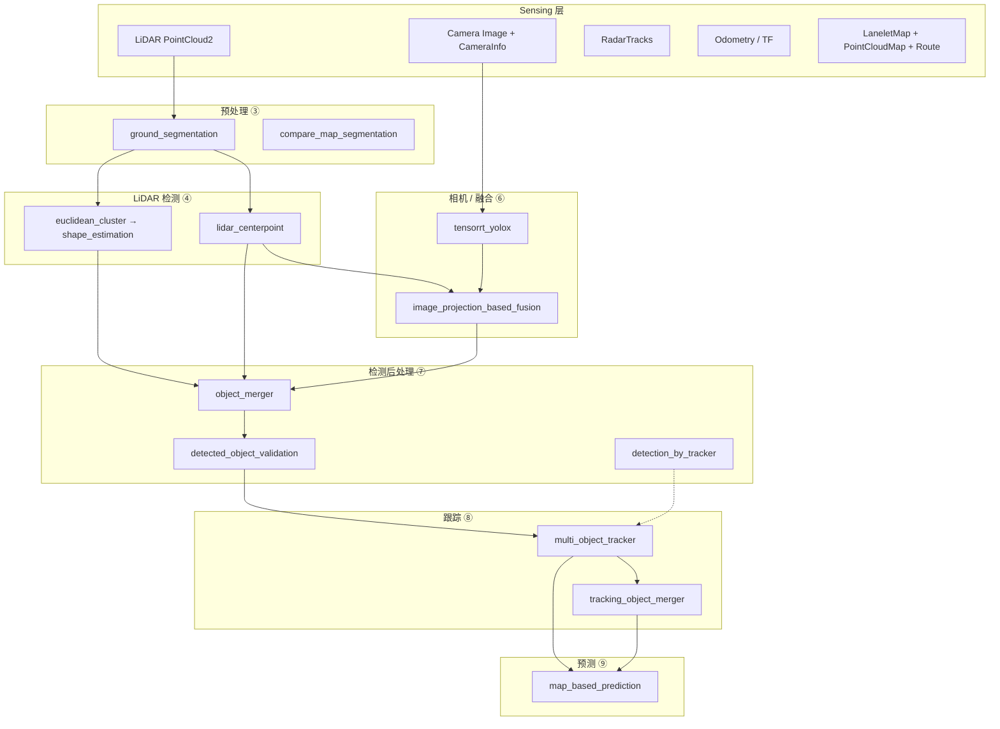
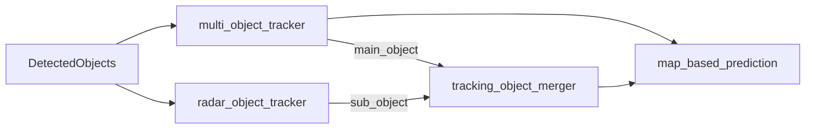

# Autoware 感知融合流水线笔记

本文档汇总 LiDAR-相机融合检测、多目标跟踪及相关模块的讨论结论，作为 `contract.md` 的补充说明。

**文档状态**：2026-06-03 初版（基于 perception 目录源码与 README）。

---

## 1. 整体架构分层

Autoware 感知不是单条直线，而是 **多传感器并行检测 → 合并/验证 → 统一跟踪 →（可选）跟踪级融合 → 行为预测** 的分层架构。



---

## 2. 典型端到端路径

| 路径名称 | 包序列（完整版） | 说明 |
|----------|------------------|------|
| **LiDAR DNN 检测** | `ground_segmentation` → `lidar_centerpoint` → `object_merger` → `detected_object_validation` → `multi_object_tracker` → `map_based_prediction` | 纯 LiDAR DNN 主流配置 |
| **LiDAR 聚类检测** | `ground_segmentation` → `euclidean_cluster` → `cluster_merger` → `shape_estimation` → `raindrop_cluster_filter` → `detected_object_feature_remover` → … → `MOT` | 规则/低成本检测 |
| **LiDAR-相机融合** | `lidar_centerpoint` + `tensorrt_yolox` → `image_projection_based_fusion`（`roi_detected_object_fusion`）→ `object_merger` → `detected_object_validation` → `MOT` | 用相机 ROI 验证 LiDAR 检测 |
| **雷达增强** | `radar_tracks_msgs_converter` → … → `radar_object_tracker` → `radar_fusion_to_detected_object` → `tracking_object_merger` | 远距/速度补充 |
| **跟踪反馈检测** | 聚类检测 + MOT 的 `TrackedObjects` → `detection_by_tracker` → 作为 MOT 额外输入通道 | 稳定持续检测 |

> `contract.md` 中的 LiDAR-相机路径省略了 `object_merger` 与 `detected_object_validation`，那是简化版；生产环境通常仍会经过这两步。

---

## 3. LiDAR-相机融合路径详解

### 3.1 数据流

```
PointCloud2
  → ground_segmentation
  → lidar_centerpoint
      输出 DetectedObjects（3D 框：位姿、尺寸、类别、置信度）

Image
  → tensorrt_yolox
      输出 DetectedObjectsWithFeature（2D ROI + 类别 + 置信度）

CenterPoint DetectedObjects + 多路 YOLOX ROI + CameraInfo
  → roi_detected_object_fusion
      输出 DetectedObjects（经相机验证/filter 后的 3D 框）

  → object_merger / detected_object_validation
  → multi_object_tracker
      输出 TrackedObjects（UUID + 速度）
  → map_based_prediction
      输出 PredictedObjects
```

### 3.2 融合节点职责（roi_detected_object_fusion）

融合 **不是** 把 2D 框抬升为 3D，而是：

1. **时间对齐**：`FusionCollector` 收集同一逻辑帧的 LiDAR 检测（msg3d）与全部相机 ROI，通过 `rois_timestamp_offsets` 补偿快门时差。
2. **空间匹配**：3D 框角点投影到图像平面 → 与 YOLOX ROI 计算 IoU。
3. **类别门控**：`can_assign_matrix` 限制 LiDAR 类别与相机类别能否配对。
4. **三类处置**：
   - **Passthrough**：LiDAR 置信度极高或距离超过 `trust_distances` → 直接输出；
   - **Fused**：IoU > `min_iou_threshold` → 保留；
   - **Ignored**：无视觉证据 → 丢弃（抑制 LiDAR 幽灵目标）。

3D 几何始终来自 CenterPoint；相机提供 **二次确认**。

### 3.3 MOT 跟踪流程（每帧）

```
predict（所有 tracker 外推到测量时刻）
  → associate（muSSP 全局最优匹配：tracker ↔ detection）
  → update（有关联：EKF 更新；无关联：无测量更新，存在概率衰减）
  → prune（删除过期 / 合并重叠 tracker）
  → spawn（未匹配检测 → 新建 tracker + 新 UUID）
  → publish TrackedObjects
```

### 3.4 多重门控（MOT / object_merger 关联）

**不是权重相加**，而是 **串行 AND 硬门控 + 单一距离 score**：

```
score = 0  if 类别不可匹配 (can_assign)
      = 0  if dist > max_dist
      = 0  if area ∉ [min_area, max_area]
      = 0  if |Δyaw| > max_rad
      = 0  if Mahalanobis > 3.035
      = 0  if IoU < min_iou
      = (max_dist - dist) / max_dist   （全部通过后）
      = 0  if score < 0.01
```

门控决定「能不能配」，距离决定「配了有多好」；IoU、马氏距离等 **不参与 score 加权**。全局分配由 **muSSP** 在 score 矩阵上求最大权匹配。

详见 `topic.md` 中消息与关联章节。

---

## 4. MOT 与 TOM 的区别

| 维度 | **MOT**（`multi_object_tracker`） | **TOM**（`tracking_object_merger`） |
|------|-----------------------------------|-------------------------------------|
| **角色** | 检测 → 跟踪（时序化） | 跟踪 + 跟踪 → 融合跟踪 |
| **输入** | `DetectedObjects`（无 ID） | 两路 `TrackedObjects`（已有 ID） |
| **输出** | `TrackedObjects` | `TrackedObjects`（融合后） |
| **核心算法** | 多类别 EKF + muSSP 关联 | 主/辅传感器规则融合（无 EKF） |
| **ID** | spawn 时随机生成 UUID，关联维护 | 保留主传感器 UUID |
| **输入数量** | 1~N 路检测（可配置 channel） | 固定 2 路：main + sub |
| **典型 main/sub** | — | LiDAR MOT / Radar tracker |
| **状态融合优先级** | 各通道 trust flags 控制 EKF 更新 | 位姿：LiDAR>Radar>Camera；速度：Radar>LiDAR>Camera；分类：Camera>LiDAR>Radar |



**何时需要 TOM**：Radar 有独立 tracker、需在 **轨迹层面** 用 Radar 补速度、用 Camera 补分类，且避免低精度检测直接污染 LiDAR EKF 时。

**何时只需 MOT**：纯 LiDAR DNN 或 LiDAR+相机融合检测，无独立雷达跟踪链路。

---

## 5. 消息形态演变

| 阶段 | 消息类型 | 关键特征 |
|------|----------|----------|
| LiDAR/相机检测 | `DetectedObjects` / `DetectedObjectsWithFeature` | 无 `object_id`，单帧 |
| 融合/合并/验证后 | `DetectedObjects` | 无 ID，3D 状态来自 LiDAR |
| MOT 输出 | `TrackedObjects` | 有 `object_id`（UUID），有速度 |
| TOM 输出 | `TrackedObjects` | 主路 UUID 不变，状态按优先级融合 |
| 预测输出 | `PredictedObjects` | 带未来路径概率 |

Topic 命名与字段详情见 **`topic.md`**。

---

## 6. 相关源码与配置

| 主题 | 路径 |
|------|------|
| 融合 ROI 匹配 | `autoware_image_projection_based_fusion/src/roi_detected_object_fusion/node.cpp` |
| MOT 关联门控 | `autoware_multi_object_tracker/lib/association/association.cpp` |
| MOT 门控参数 | `autoware_multi_object_tracker/config/data_association_matrix.param.yaml` |
| MOT 输入通道 | `autoware_multi_object_tracker/config/input_channels.param.yaml` |
| TOM 融合策略 | `autoware_tracking_object_merger/README.md` |
| 包对比总表 | `contract.md` |

---

## 修订记录

| 日期 | 说明 |
|------|------|
| 2026-06-03 | 初版：整体流程、LiDAR-相机融合、门控逻辑、MOT vs TOM |
