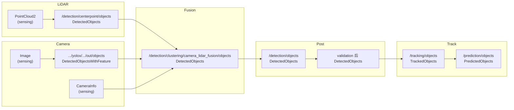

# 感知-融合 Topic 与消息格式

本文档记录 Autoware 感知链路中 **节点间消息传递**、**Topic 命名约定** 与 **消息字段结构**，重点覆盖 LiDAR-相机融合路径及下游跟踪。

**文档状态**：2026-06-03 初版。消息定义包：`autoware_perception_msgs`、`tier4_perception_msgs`（本仓库为消费方，定义在外部依赖包中）。

---

## 1. 消息类型总览

感知链路中核心消息按「是否含跟踪 ID」「是否含 2D feature」分为四类：

| 消息类型 | 包 | 用途 | 是否含 object_id |
|----------|-----|------|------------------|
| `DetectedObjects` | `autoware_perception_msgs` | 标准 3D 检测结果 | 否 |
| `DetectedObjectsWithFeature` | `tier4_perception_msgs` | 带 2D ROI / 点云 feature 的检测 | 否 |
| `TrackedObjects` | `autoware_perception_msgs` | 跟踪结果 | 是（UUID） |
| `PredictedObjects` | `autoware_perception_msgs` | 带预测轨迹 | 是（UUID） |

辅助输入消息：

| 消息类型 | 包 | 用途 |
|----------|-----|------|
| `sensor_msgs/PointCloud2` | `sensor_msgs` | LiDAR 点云 |
| `sensor_msgs/Image` | `sensor_msgs` | 相机图像 |
| `sensor_msgs/CameraInfo` | `sensor_msgs` | 相机内参 / 畸变 / 投影矩阵 |
| `tier4_perception_msgs/RegionOfInterest` | `tier4_perception_msgs` | 2D 矩形 ROI（嵌在 WithFeature 中） |

---

## 2. 消息结构详解

### 2.1 DetectedObjects

```
autoware_perception_msgs/msg/DetectedObjects
├── std_msgs/Header header          # stamp, frame_id
└── DetectedObject[] objects
```

**DetectedObject** 主要字段：

| 字段 | 类型 | 说明 |
|------|------|------|
| `existence_probability` | `float32` | 存在置信度；CenterPoint 中为 DNN 分类分数，非严格概率 |
| `classification[]` | `ObjectClassification[]` | `{label, probability}`；label 见下表 |
| `kinematics` | `DetectedObjectKinematics` | 位姿、速度及可用性标志 |
| `shape` | `Shape` | 3D 形状（BOUNDING_BOX / CYLINDER / POLYGON） |

**DetectedObjectKinematics**：

| 字段 | 说明 |
|------|------|
| `pose_with_covariance` | 3D 位姿 + 6×6 协方差（36 元素数组） |
| `twist_with_covariance` | 线速度/角速度（检测阶段通常为空或不可靠） |
| `has_position_covariance` | 是否提供位置协方差 |
| `has_twist` / `has_twist_covariance` | 是否提供速度 |
| `orientation_availability` | `UNAVAILABLE` / `SIGN_UNKNOWN` / `AVAILABLE` |

**Shape（BOUNDING_BOX 常见）**：

| 字段 | 说明 |
|------|------|
| `type` | `BOUNDING_BOX` |
| `dimensions` | `{x=length, y=width, z=height}` |

**ObjectClassification.label 枚举**（常用）：

`UNKNOWN`, `CAR`, `TRUCK`, `BUS`, `TRAILER`, `MOTORCYCLE`, `BICYCLE`, `PEDESTRIAN`

---

### 2.2 DetectedObjectsWithFeature

```
tier4_perception_msgs/msg/DetectedObjectsWithFeature
├── std_msgs/Header header
└── DetectedObjectWithFeature[] feature_objects
```

**DetectedObjectWithFeature**：

| 字段 | 类型 | 说明 |
|------|------|------|
| `object` | `autoware_perception_msgs/DetectedObject` | 2D 检测的类别与置信度（通常无可靠 3D pose） |
| `feature.roi` | `sensor_msgs/RegionOfInterest` | 2D 框：`x_offset`, `y_offset`, `width`, `height`（像素） |
| `feature.cluster` | `sensor_msgs/PointCloud2` | 可选，聚类点云 feature |

YOLOX 输出示例（`tensorrt_yolox_node.cpp`）：

- `feature.roi` ← 2D 框像素坐标
- `object.existence_probability` ← YOLOX score
- `object.classification` ← 由 `label_file` 映射的类别
- `header` ← 与输入 `Image` 相同（相机光学 frame + 曝光时间戳）

---

### 2.3 TrackedObjects

```
autoware_perception_msgs/msg/TrackedObjects
├── std_msgs/Header header
└── TrackedObject[] objects
```

**TrackedObject** 在 DetectedObject 基础上扩展：

| 字段 | 类型 | 说明 |
|------|------|------|
| `object_id` | `unique_identifier_msgs/UUID` | 跟踪 ID（16 字节），MOT spawn 时生成，生命周期内不变 |
| `existence_probability` | `float32` | 跟踪存在概率（贝叶斯更新 + 衰减） |
| `classification[]` | `ObjectClassification[]` | 时序平滑后的类别 |
| `kinematics` | `TrackedObjectKinematics` | 含 EKF 估计的速度 |
| `shape` | `Shape` | EKF 平滑后的 3D 尺寸 |

**TrackedObjectKinematics** 额外字段：

| 字段 | 说明 |
|------|------|
| `twist_with_covariance` | **MOT 输出的核心增量**：估计的线速度 |
| `is_stationary` | 是否静止 |
| `orientation_availability` | 同检测 |

**DetectedObject → TrackedObject 转换**（`multi_object_tracker`）：

- 新增 `object_id` ← 随机 UUID
- `kinematics.twist` ← EKF 估计（检测阶段通常无速度）
- 其余字段由 EKF 持续更新

---

### 2.4 PredictedObjects

```
autoware_perception_msgs/msg/PredictedObjects
├── std_msgs/Header header
└── PredictedObject[] objects
```

**PredictedObject** 在 TrackedObject 基础上增加 `predicted_paths[]`（未来轨迹点序列 + 概率），由 `map_based_prediction` 输出。

---

## 3. Topic 命名空间约定

Autoware Universe 感知 topic 通常挂载在：

```
/perception/object_recognition/
├── detection/
│   ├── centerpoint/objects
│   ├── clustering/objects
│   ├── clustering/camera_lidar_fusion/objects   ← roi_detected_object_fusion 典型输出
│   ├── pointpainting/objects
│   ├── detection_by_tracker/objects
│   ├── radar/far_objects
│   └── objects                                  ← object_merger 合并后
├── tracking/
│   └── objects                                  ← MOT 输出
└── prediction/
    └── objects                                  ← map_based_prediction 输出
```

各节点 launch 中 topic 为 **相对名 + remap**；上表为 `input_channels.param.yaml` 等配置中的 **绝对路径惯例**。

---

## 4. LiDAR-相机融合路径：节点 I/O 对照

### 4.1 端到端 Topic 流（生产典型配置）



> 具体 YOLOX topic 名随 launch 命名空间变化（如 `/perception/object_recognition/detection/rois0`）；fusion launch 通过 remap 接入。

### 4.2 各节点端口明细

#### ground_segmentation

| 方向 | Topic（节点相对名） | 消息类型 |
|------|---------------------|----------|
| 入 | `~/input/points` | `sensor_msgs/PointCloud2` |
| 出 | `~/output/points` | `sensor_msgs/PointCloud2` |

#### lidar_centerpoint

| 方向 | Topic | 消息类型 |
|------|-------|----------|
| 入 | `~/input/pointcloud` | `PointCloud2` |
| 出 | `~/output/objects` | `DetectedObjects` |

**CenterPoint 填充字段**：`pose`, `shape.dimensions`, `classification`, `existence_probability`（DNN score）；车辆类通常 `orientation_availability=SIGN_UNKNOWN`；默认无 `twist`。

#### tensorrt_yolox

| 方向 | Topic | 消息类型 |
|------|-------|----------|
| 入 | `in/image` | `sensor_msgs/Image` |
| 出 | `out/objects` | `DetectedObjectsWithFeature` |

**YOLOX 填充字段**：仅 `feature.roi` + `object.classification` + `object.existence_probability`；**无 3D pose**。

#### roi_detected_object_fusion

| 方向 | Topic（launch 相对名） | 消息类型 |
|------|------------------------|----------|
| 入 | `input` | `DetectedObjects`（CenterPoint） |
| 入 | `input/rois[0-7]` | `DetectedObjectsWithFeature`（YOLOX） |
| 入 | `input/camera_info[0-7]` | `sensor_msgs/CameraInfo` |
| 入 | `input/image_raw[0-7]` | `sensor_msgs/Image`（debug 可选） |
| 出 | `output` | `DetectedObjects` |
| 出 debug | `debug/fused_objects`, `debug/ignored_objects` | `DetectedObjects` |

**融合前后消息变化**：

| 项目 | 融合前（CenterPoint） | 融合后 |
|------|----------------------|--------|
| 消息类型 | `DetectedObjects` | `DetectedObjects`（不变） |
| 目标数量 | N | ≤ N（ignored 被滤除） |
| 3D 字段 | 完整 | **保持不变**（来自 LiDAR） |
| object_id | 无 | 无 |
| header.stamp | LiDAR 帧时间 | LiDAR 帧时间（msg3d） |
| header.frame_id | 通常 `base_link` 或 `map` | 同输入 |

**时间同步参数**（`fusion_common.param.yaml`）：

- `rois_timestamp_offsets[]`：各相机 ROI 相对 LiDAR 的时间偏移
- `msg3d_timeout_sec` / `rois_timeout_sec`：Collector 等待超时
- `matching_strategy`：`naive` 或 `advanced`

#### object_merger

| 方向 | Topic | 消息类型 |
|------|-------|----------|
| 入 | `input/object0`, `input/object1` | `DetectedObjects` |
| 出 | `output/object` | `DetectedObjects` |

两路检测经 **关联 + 优先级合并**（非简单拼接）；关联门控逻辑与 MOT 类似（串行 AND + 距离 score）。

#### detected_object_validation

| 方向 | Topic | 消息类型 |
|------|-------|----------|
| 入 | `~/input/detected_objects` | `DetectedObjects` |
| 入 | 点云 / OGM / vector_map（按验证器） | 多种 |
| 出 | `~/output/objects` | `DetectedObjects` |

#### multi_object_tracker

| 方向 | Topic | 消息类型 |
|------|-------|----------|
| 入 | 由 `selected_input_channels` 配置 | `DetectedObjects` |
| 出 | `~/output` | `TrackedObjects` |

**默认合并检测 topic**：`/perception/object_recognition/detection/objects`

**LiDAR-相机融合专用 channel**（`input_channels.param.yaml`）：

```yaml
camera_lidar_fusion:
  topic: "/perception/object_recognition/detection/clustering/camera_lidar_fusion/objects"
  flags:
    can_spawn_new_tracker: true
    can_trust_existence_probability: false   # 融合后置信度不可直接信
    can_trust_extension: false               # 尺寸仍来自 LiDAR 通道
    can_trust_classification: true           # 可信任分类
    can_trust_orientation: false
```

#### tracking_object_merger（可选）

| 方向 | Topic | 消息类型 |
|------|-------|----------|
| 入 | `input/main_object` | `TrackedObjects`（LiDAR MOT） |
| 入 | `input/sub_object` | `TrackedObjects`（Radar tracker） |
| 出 | `output/object` | `TrackedObjects` |

**消息变化**：`object_id` 保留主路 UUID；`kinematics.twist` 等按传感器优先级字段级融合。

#### map_based_prediction

| 方向 | Topic | 消息类型 |
|------|-------|----------|
| 入 | `/perception/object_recognition/tracking/objects` | `TrackedObjects` |
| 出 | `~/output/objects` | `PredictedObjects` |

---

## 5. 坐标系与时间戳

| 节点 | header.frame_id 典型值 | 时间戳来源 |
|------|------------------------|------------|
| CenterPoint | `base_link` 或 `map`（可配 `world_frame_id`） | 点云 header.stamp |
| YOLOX | 相机 optical frame | 图像 header.stamp |
| Fusion 输出 | 与 CenterPoint 输入相同 | CenterPoint msg3d.stamp |
| MOT | 变换到 `world_frame_id`（通常 `map`）后发布 | 检测消息 stamp |

**融合投影依赖 TF**：3D 目标 frame → 各相机 frame（`tf2` + `CameraInfo` 投影）。

**MOT 内部**：`InputManager` 将各通道 `DetectedObjects` 变换到 world frame，再关联。

---

## 6. 关联阶段的消息使用（补充）

融合阶段（LiDAR↔相机）与跟踪阶段（检测↔轨迹）使用不同匹配逻辑：

| 阶段 | 输入消息 | 匹配依据 | 输出 |
|------|----------|----------|------|
| roi_detected_object_fusion | `DetectedObjects` + `DetectedObjectsWithFeature` | 3D 投影 IoU + `can_assign_matrix` | 过滤后的 `DetectedObjects` |
| MOT associate | `DetectedObjects` + 内部 tracker 状态 | 6 重门控 + 距离 score + muSSP | 更新 `TrackedObjects` |
| object_merger | 两路 `DetectedObjects` | 3 重门控 + 距离 score + muSSP | 合并 `DetectedObjects` |
| TOM | 两路 `TrackedObjects` | 5 重门控（含速度差）+ 距离 score | 融合 `TrackedObjects` |

**共同点**：门控为 **串行 AND**（任一失败 → score=0），score 仅由 **BEV 距离** 归一化计算，**非多指标加权求和**。

---

## 7. 快速查阅：谁产生 / 消费 object_id

| object_id | 产生节点 | 消费节点 |
|-----------|----------|----------|
| 无 | 所有检测节点 | MOT（spawn 前） |
| UUID | MOT（spawn） | TOM、detection_by_tracker、map_based_prediction、Planning |

---

## 8. 调试命令

```bash
# 查看 topic 类型与频率
ros2 topic list -t | grep object_recognition

# 查看消息 header（时间戳 / frame_id）
ros2 topic echo /perception/object_recognition/detection/centerpoint/objects --header-field

# 查看单条 TrackedObject 的 UUID
ros2 topic echo /perception/object_recognition/tracking/objects --field objects[0].object_id
```

---

## 修订记录

| 日期 | 说明 |
|------|------|
| 2026-06-03 | 初版：消息类型、LiDAR-相机融合路径 Topic I/O、字段演变 |
